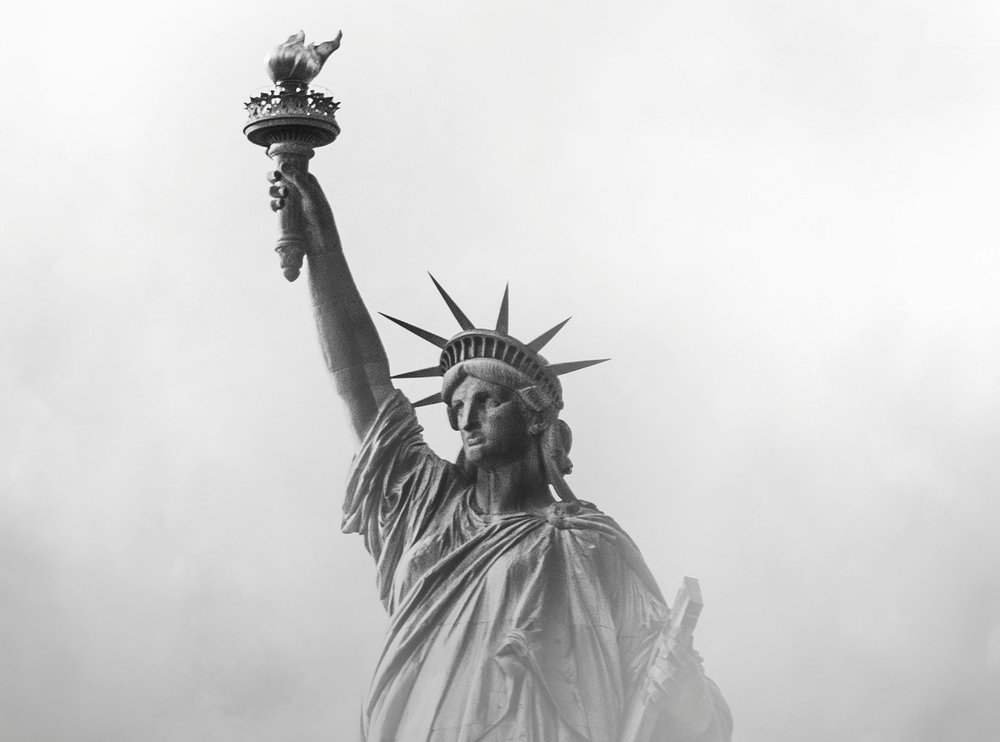
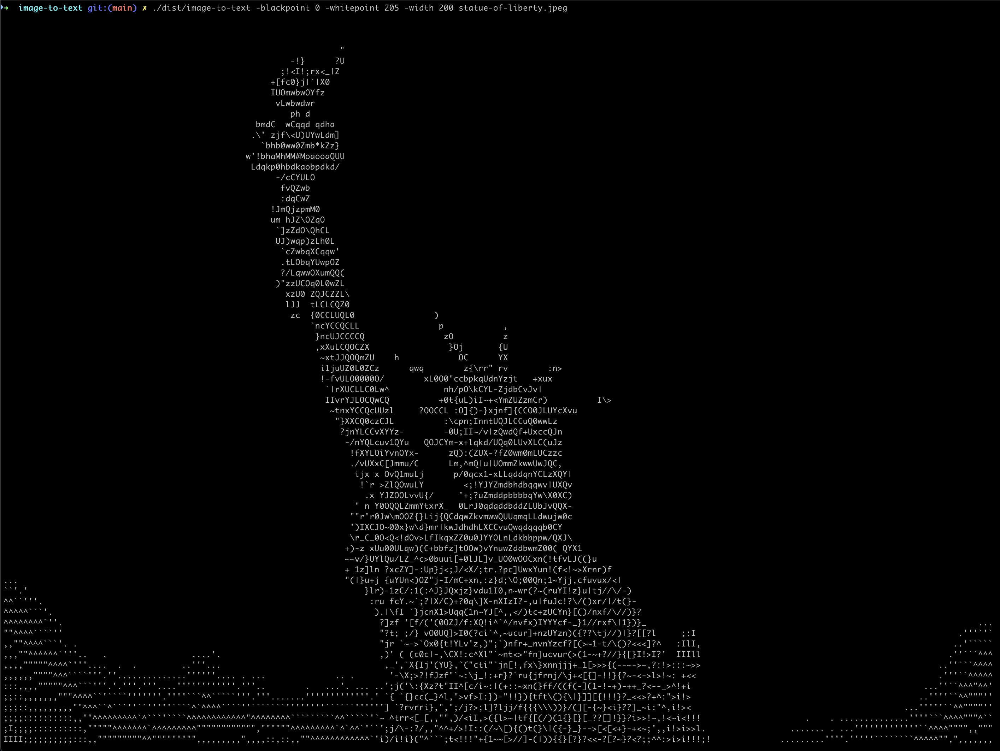

# image-to-text

A CLI tool that converts images to ASCII art.

Input image                       | Output text
:--------------------------------:|:-------------------------:
 | 

## Build

```bash
make build
```

This creates the binary at `dist/image-to-text`.

Other targets:
- `make test` - run tests
- `make clean` - remove build artifacts

## Usage

```bash
./dist/image-to-text [options] <image-file>
```

### Options

| Flag | Default | Description |
|------|---------|-------------|
| `-width` | 80 | Output width in characters |
| `-invert` | false | Invert brightness (for dark terminal backgrounds) |
| `-blackpoint` | 0 | Gray value for pure black (0-255) |
| `-whitepoint` | 255 | Gray value for pure white (0-255) |

### Examples

```bash
# Basic usage
./dist/image-to-text photo.png

# Wider output
./dist/image-to-text -width 120 photo.jpg

# For dark terminal backgrounds
./dist/image-to-text -invert photo.png

# Increase contrast by narrowing the gray range
./dist/image-to-text -blackpoint 50 -whitepoint 200 photo.png

# Run without building
go run . photo.png
```

## Supported Formats

- PNG
- JPEG
- GIF
